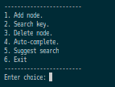
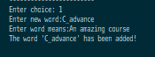
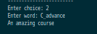
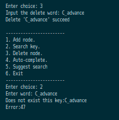
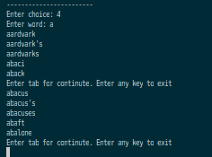

# Project 1 C Advance
# Introduction

This is mini-project on C-advanced course.
Project impletement a dictionary using B-tree data structure. Project have 5 functions:
- Add a word to dictionary
- Search a word
- Delete a word
- Get auto-complete when typing prefix
- Get similar word using soundex algorithm

# Instructions 
- Firstly, clone this repo to same directory with bt-5.0.0 library. 
- Create data directory.
- Compile and run init_data.c file.
- After run init_data.c, you will see 3 btree file in the data directory. 
- Compile and run main.c file (command to run two mentioned file in [cm.sh](./cm.sh) file)
- When you run main.c file. You will see a menu like this.

- Choose option 1 to add a word to database.

- Now, let search the previouse added word.

- Let's try to delete "C_advance" word and search it again.

- Auto-complete: Enter a prefix and press tab. The words which start with the prefix will be print. Press tab again to get more words.  

- Soundex. Similar with option 3

# Preference
Some idea of this project is taken from 2 below repositories
> [91Dict](https://github.com/91ICT/91Dict)

> [C_Advancd](https://github.com/phuong1492/C_Advance)

# Thank you